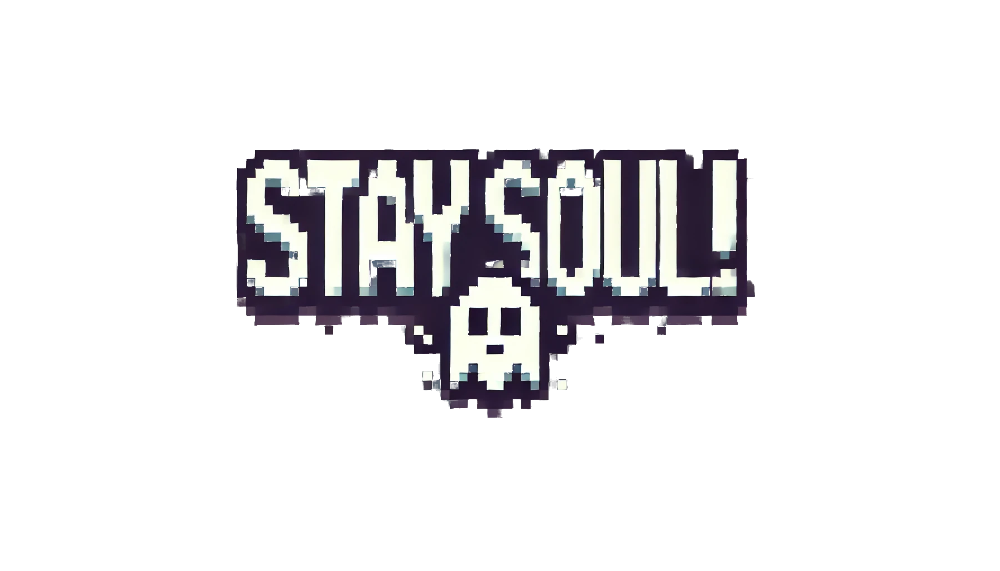
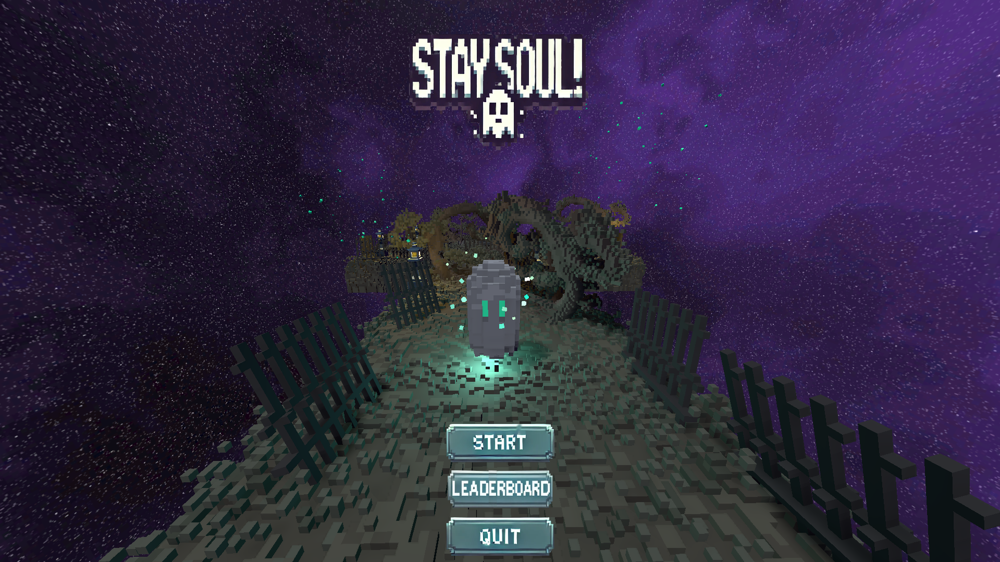
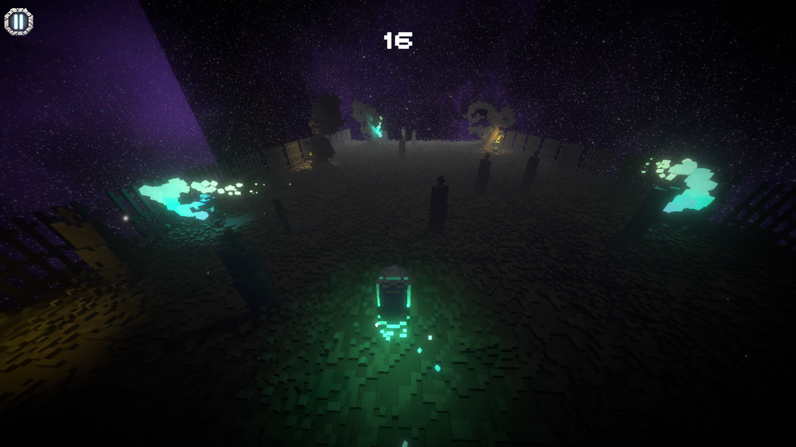

# StaySoul - GAME JAM

## Description

    

**StaySoul** is a video game created during the TAP NATION Game Jam, based on the theme **"Children's Games"**. Inspired by the famous children's game "1, 2, 3, soleil" (also known as "Red Light, Green Light"), StaySoul immerses you in a world where a ghost must traverse a dynamically generated map while avoiding traps and responding to a mysterious countdown.

The objective of the game is simple: move your ghost across the map without getting caught by the end of the countdown. However, beware! Light effects and sound cues will disturb your movements, and you'll need to act quickly and strategically to avoid traps and stay safe.

    

## Gameplay

In StaySoul, you play as a ghost moving across a map that is generated in real time ahead of you. Each time a light effect is triggered along with a sound, the ghost must **stop immediately**.

- **Countdown:** A countdown is triggered, and you must stop moving before it ends.
- **Light & Sound Cues:** Light effects and sound cues signal when you must stop, similar to "1, 2, 3, soleil." You need to be precise and quick!
- **Traps:** Traps appear on the map from time to time, forcing you to navigate carefully to avoid falling into them.
- **Deceptive Countdown:** Sometimes, the countdown **doesn’t trigger properly**, creating a sense of tension and uncertainty. Stay alert to avoid being tricked.

    

## Objectives

- Stop before the countdown ends by using your timing and observation skills.
- Avoid the traps that randomly appear on the map.
- Stay focused and react quickly to light and sound signals.
- Explore the generated map and see how long you can last!
- Make the best record!

## Controls

- **On Mobile:** Tap and hold to move the ghost in the direction you want. Release to stop.
- **On Desktop (Mouse):** Click and hold to move the ghost. Release to stop when the light and sound cues trigger.
- **Stop:** When the light effect and sound cue trigger, stop moving immediately!

## Technologies

- **Game Engine:** Unity
- **Programming Language:** C#
- **Audio:** Sound effects and music integrated to create a tense atmosphere.
- **Graphics:** 2D art style for a childlike, yet eerie ambiance.

## Assets Used

- **Voxels:** The voxel-based assets used for the environment were sourced from [Voxel Graveyard by Max Parata](https://maxparata.itch.io/voxelgraveyard).

## Tags

- 3D
- Arcade
- Endless Runner
- Simple
- Singleplayer
- Third Person
- Voxel

## Installation

To play StaySoul, download the game directly from our [Itch.io page](https://46yuu.itch.io/staysoul). The game is available for Windows, Mac, and mobile platforms.

### Installation Steps:

1. Visit the [StaySoul Itch.io page](https://46yuu.itch.io/staysoul).
2. Download the game for your platform (Windows, Mac, or mobile).
3. Extract the file to a folder of your choice (if applicable).
4. Launch the executable file (`StaySoul.exe` for Windows or `StaySoul.app` for Mac), or install the mobile version on your phone.
5. Enjoy the game!

## Contribute

StaySoul was created during the TAP NATION Game Jam, and we are open to contributions, whether it’s for adding features, gameplay ideas, or improving graphics and audio. If you'd like to contribute, feel free to open a **pull request** or contact us.

## Credits

- **Development:**
    - [Zhailendra](https://github.com/Zhailendra)
    - [46Yuu](https://github.com/46Yuu)
    - [PoloBongo](https://github.com/PoloBongo)
    - [MtPoison](https://github.com/MtPoison)
    - [FrancoisCantineau](https://github.com/FrancoisCantineau)
